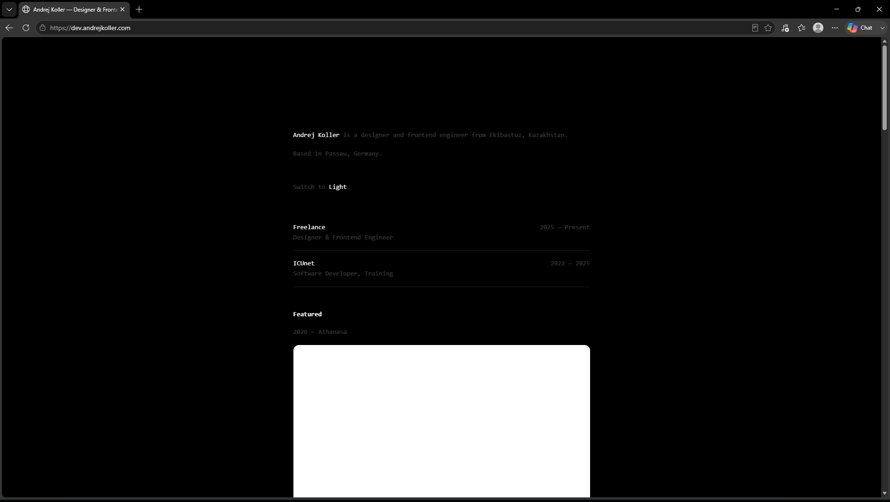
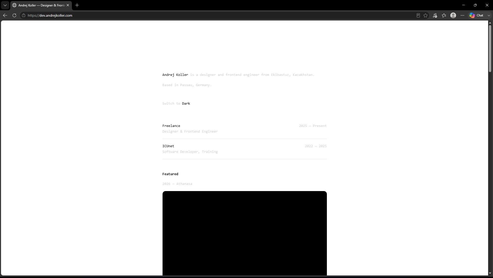

# dev-andrejkoller-next

A minimalist portfolio website showcasing products, projects, and creative work. Built with modern web technologies and a focus on performance, accessibility, and clean design.

## Features

- **Server-Side Rendering** - Fast initial page loads with Next.js App Router
- **Responsive Design** - Mobile-first layout with Tailwind CSS v4 and custom breakpoints
- **Fade-in Animations** - Staggered entrance animations for a smooth page experience
- **Custom Theming** - CSS custom properties for consistent dark color palette
- **Modular Architecture** - Separated Header, Footer, and layout components
- **Google Fonts** - Geist Sans and Geist Mono via `next/font`
- **Work Experience Section** - Configurable work history with company, role, and period
- **TypeScript** - Full type safety across the application
- **Social Links** - Footer with links to X, Dribbble, GitHub, and LinkedIn

## Tech Stack

- **Framework**: [Next.js 16](https://nextjs.org) (App Router)
- **Language**: TypeScript
- **Library**: React 19
- **Styling**: Tailwind CSS v4

## Prerequisites

- Node.js 18.x or higher
- npm, yarn, pnpm, or bun

## Installation

1. Clone the repository

```bash
git clone https://github.com/andrejkoller/dev-andrejkoller-next.git
cd dev-andrejkoller-next
```

2. Install dependencies

```bash
npm install
```

3. Run the development server:

```bash
npm run dev
```

Open [http://localhost:3000](http://localhost:3000) in your browser.

## Project Structure

```
dev-andrejkoller-next/
├── app/
│   ├── styles/
│   │   └── globals.css           # Global styles
│   ├── client-layout.tsx         # Client-side layout wrapper
│   ├── layout.tsx                # Root layout
│   └── page.tsx                  # Home page
├── components/
│   ├── theme/
│   │   ├── theme-context.ts      # Theme React context
│   │   ├── theme-provider.tsx    # Theme provider component
│   │   ├── theme-switcher.tsx    # Theme toggle button
│   │   ├── types.ts              # Theme types
│   │   └── use-theme.ts          # useTheme hook
│   ├── footer.tsx                # Footer component
│   └── header.tsx                # Header component
├── configs/
│   ├── experience-config.ts      # Work experience configuration
│   ├── footer-links-config.ts    # Footer social links configuration
│   └── project-links-config.ts  # Project links configuration
├── public/
│   └── images/
│       ├── screenshot-1.png
│       └── screenshot-2.png
├── custom.d.ts                   # Custom TypeScript declarations
├── eslint.config.mjs             # ESLint configuration
├── LICENSE
├── next-env.d.ts                 # Next.js TypeScript declarations
├── next.config.ts                # Next.js configuration
├── package.json
├── postcss.config.mjs            # PostCSS configuration
├── README.md
├── SECURITY.md
└── tsconfig.json                 # TypeScript configuration
```

## Screenshots




## License

This project is licensed under the [MIT License](LICENSE).
